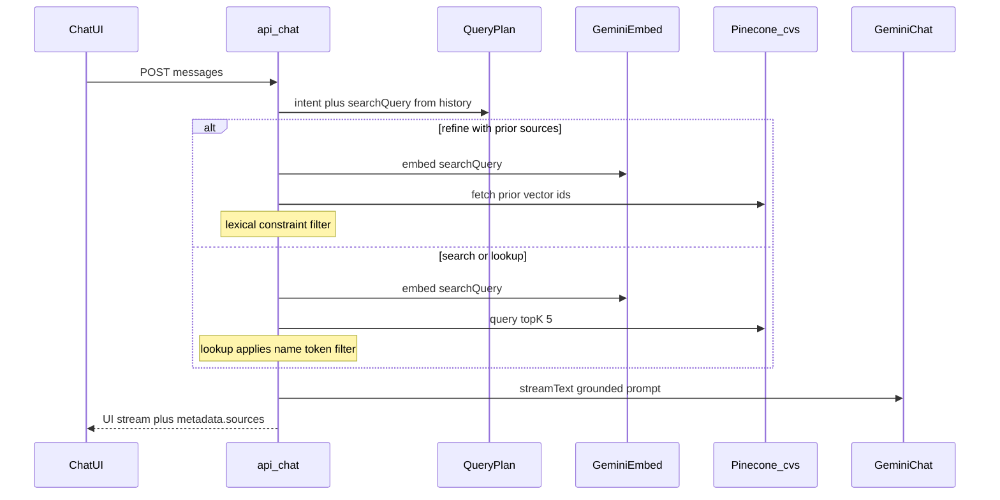

# ADR 004: Chat RAG Query Path

## Context

After indexing 25 CVs in Pinecone (ADR 003), the product needs a request path that:

1. Accepts a user question from the chat UI
2. Retrieves the most relevant CVs
3. Generates an answer grounded in that context
4. Surfaces which CV files were used (optional task nicety)
5. Keeps multi-turn screening consistent (narrow previous results) and avoids leaking unrelated source badges on name lookups

Constraints: same TypeScript/Next.js app, free-tier friendly, easy to explain, demo-reliable.

## Decision

| Topic | Choice | Why |
|-------|--------|-----|
| Endpoint | `POST` [`app/api/chat/route.ts`](../../app/api/chat/route.ts) | Matches Vercel AI SDK `useChat` default |
| Streaming | AI SDK `streamText` + `toUIMessageStream` / `createUIMessageStreamResponse` | Native fit for `@ai-sdk/react` UI |
| Chat model | Gemini via `@ai-sdk/google` (`GEMINI_CHAT_MODEL` or `GEMINI_CV_GEN_MODEL`) | Same vendor as embeddings; already required |
| Query plan | Heuristics first in [`lib/rag/query-plan.ts`](../../lib/rag/query-plan.ts); Gemini `generateObject` only when ambiguous | Cuts a full LLM round-trip on typical demo turns |
| Query embed | `embedText` in `lib/rag/embeddings.ts` on `searchQuery` | Same 768-dim model as indexing |
| Retrieval (search) | Pinecone `query` on namespace `cvs`, `topK: 5` | Default skill / criteria search |
| Retrieval (refine) | Pinecone `fetch` of prior `metadata.sources` + lexical constraint filter ([`lib/rag/constraint-filter.ts`](../../lib/rag/constraint-filter.ts)) | Hard intersection without a second LLM call |
| Retrieval (lookup) | Pinecone `query` + token name filter in [`lib/rag/name-match.ts`](../../lib/rag/name-match.ts) | Partial names like "Jane" keep only that CV in context and badges |
| Pinecone client | Cached `describeIndex` host (~10 min TTL) in [`lib/rag/pinecone.ts`](../../lib/rag/pinecone.ts) | Avoids an extra network hop per request |
| Grounding | System/instructions built from retrieved `fullName` / `fileName` / `text` | Answer only from CVs; refine/lookup mode notes |
| Sources | `message.metadata.sources` = unique `fileName`s after filtering | UI badges + PDF side panel (`/api/cvs/[file]`) |
| Vector IDs | [`lib/rag/cv-ids.ts`](../../lib/rag/cv-ids.ts) shared with indexer | Stable `fetch` by id for refine |
| OpenRouter | Not used on this path | Keeps one chat provider for reliability |

## Consequences

**Benefits**

- End-to-end Gemini stack (embed + answer) is simple to operate and explain
- Streaming keeps the UI responsive
- Source badges make retrieval auditable without stuffing filenames into the prose
- Multi-turn "of these…" refinements intersect the previous candidate set
- Name lookups no longer attach unrelated top-K PDF badges
- Heuristic planning + lexical refine avoid 1–2 Gemini calls on common paths
- Cached Pinecone host reduces per-request overhead
- Reuses indexing helpers; shared vector id helper with `scripts/index-cvs.ts`

**Trade-offs**

- `topK: 5` may miss a relevant CV on rare queries (acceptable for 25-doc demo)
- Ambiguous follow-ups still pay for a short Gemini structured call
- Lexical refine can miss paraphrases / synonyms not present as tokens in the CV text
- `describeIndex` still runs on cold start / cache expiry
- PDF preview depends on files present under `cvs/` (committed for the take-home)
- Refine depends on assistant `metadata.sources` round-tripping through `useChat`

## Alternatives considered

| Alternative | Why not |
|-------------|---------|
| OpenRouter for chat | Extra vendor on the critical demo path; Gemini already required for embeddings |
| LangChain / LlamaIndex agent | Unnecessary abstraction for fixed retrieve-then-generate |
| Return full CV text only (no LLM) | Weaker UX; task expects an assistant-style answer |
| Larger `topK` or reranking | Extra cost/latency; not needed at 25 CVs |
| Skill tags in Pinecone metadata | Would need reindex; token/LLM filter is enough for the demo corpus |

## Follow-ups

- Optional smaller model exclusively for rare ambiguous query plans
- ADR update if OpenRouter is wired as a chat fallback
