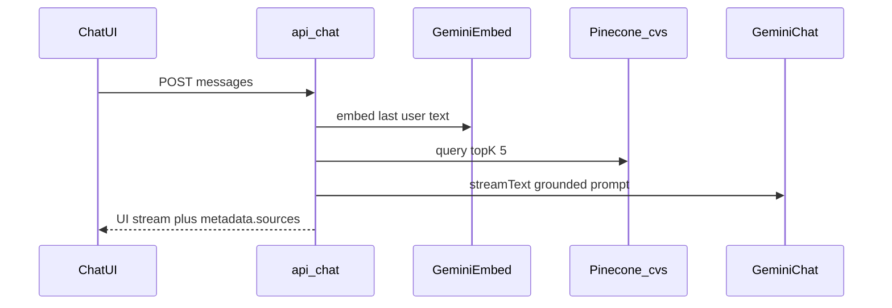

# ADR 004: Chat RAG Query Path

| Field | Value |
|-------|--------|
| Status | Accepted |
| Date | 2026-09-08 |
| Context | Technical take-home: chat UI that answers only from indexed CVs |

## Context

After indexing 25 CVs in Pinecone (ADR 003), the product needs a request path that:

1. Accepts a user question from the chat UI
2. Retrieves the most relevant CVs
3. Generates an answer grounded in that context
4. Surfaces which CV files were used (optional task nicety)

Constraints: same TypeScript/Next.js app, free-tier friendly, easy to explain, demo-reliable.

## Decision

| Topic | Choice | Why |
|-------|--------|-----|
| Endpoint | `POST` [`app/api/chat/route.ts`](../../app/api/chat/route.ts) | Matches Vercel AI SDK `useChat` default |
| Streaming | AI SDK `streamText` + `toUIMessageStream` / `createUIMessageStreamResponse` | Native fit for `@ai-sdk/react` UI |
| Chat model | Gemini via `@ai-sdk/google` (`GEMINI_CHAT_MODEL` or `GEMINI_CV_GEN_MODEL`) | Same vendor as embeddings; already required |
| Query embed | `embedText` in `lib/rag/embeddings.ts` | Same 768-dim model as indexing |
| Retrieval | Pinecone `query` on namespace `cvs`, `topK: 5`, `includeMetadata: true` | Enough context for demo questions without flooding the prompt |
| Grounding | System/instructions built from retrieved `fullName` / `fileName` / `text` | Answer only from CVs; refuse when context is thin |
| Sources | `message.metadata.sources` = unique `fileName`s | UI badges + PDF side panel (`/api/cvs/[file]`) |
| OpenRouter | Not used on this path | Keeps one chat provider for reliability |

## Consequences

**Benefits**

- End-to-end Gemini stack (embed + answer) is simple to operate and explain
- Streaming keeps the UI responsive
- Source badges make retrieval auditable without stuffing filenames into the prose
- Reuses indexing helpers; no duplicate Pinecone/embed clients

**Trade-offs**

- `topK: 5` may miss a relevant CV on rare queries (acceptable for 25-doc demo)
- `describeIndex` on each request adds a small latency cost (could cache host later)
- PDF preview depends on files present under `cvs/` (committed for the take-home)

## Alternatives considered

| Alternative | Why not |
|-------------|---------|
| OpenRouter for chat | Extra vendor on the critical demo path; Gemini already required for embeddings |
| LangChain / LlamaIndex agent | Unnecessary abstraction for fixed retrieve-then-generate |
| Return full CV text only (no LLM) | Weaker UX; task expects an assistant-style answer |
| Larger `topK` or reranking | Extra cost/latency; not needed at 25 CVs |

## Follow-ups

- Optional host caching for Pinecone after first `describeIndex`
- ADR update if OpenRouter is wired as a chat fallback
